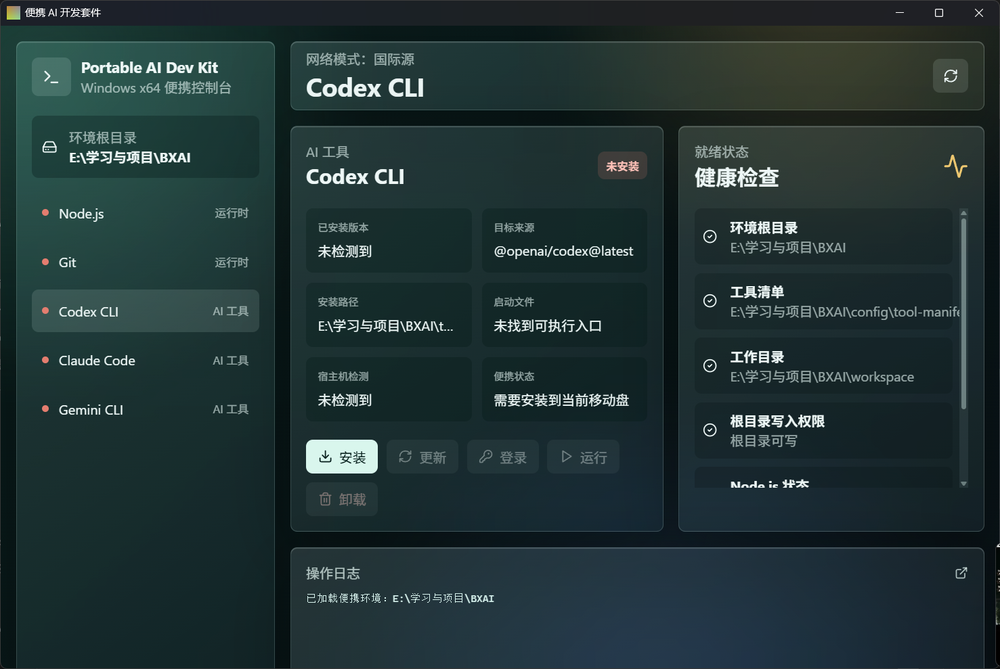

# 便携 AI 开发套件

便携 AI 开发套件是一个面向 Windows x64 的桌面控制台，用于把 AI 开发工具放进 U 盘、移动硬盘或外置 SSD 中随身携带。

它的目标是解决频繁更换工作设备时没有开发环境的问题：即使目标电脑没有安装 Node.js、Git、Codex CLI、Claude Code、Gemini CLI，也可以通过移动盘里的集成环境安装、更新、卸载和运行这些工具。

[English](README.md)



## 当前能力

- 提供 `Tauri + React + TypeScript` 桌面 GUI。
- 在当前移动盘根目录初始化便携工作区。
- 安装和管理 Node.js、Git 等便携运行时。
- 安装和管理 AI CLI 工具：
  - Codex CLI：`@openai/codex`
  - Claude Code：`@anthropic-ai/claude-code`
  - Gemini CLI：`@google/gemini-cli`
- 显示已安装版本、目标来源、安装路径、启动入口和宿主机可用性。
- 支持一键安装、更新、卸载、登录和运行。
- 启动 AI 工具时把 `HOME`、`USERPROFILE`、`APPDATA`、`LOCALAPPDATA`、`XDG_*` 重定向到移动盘 `state/` 目录。
- 不写系统 PATH，不要求管理员权限，尽量减少对宿主机环境的污染。

## 便携语义

应用会区分两种状态：

- **已安装到移动盘**：工具存在于套件目录内，可以跟随移动盘迁移。
- **仅宿主机可用**：工具存在于当前电脑的全局环境中，但换电脑后不可依赖。

宿主机检测只作为提示。只有通过本套件安装到当前移动盘的工具，才会被视为真正的便携可用状态。

## 运行要求

- Windows x64。
- 首次安装运行时和 AI CLI 需要联网。
- 正常使用不需要管理员权限。

## 快速开始

在项目目录中运行：

```powershell
npm install --cache .\cache\npm --registry https://registry.npmjs.org/
npm run tauri:build
.\src-tauri\target\release\portable-ai-dev-kit.exe
```

如果国内网络访问 npm 官方源较慢，可使用：

```powershell
npm install --cache .\cache\npm --registry https://registry.npmmirror.com/
```

也可以运行：

```powershell
.\Start.cmd
```

`Start.cmd` 会优先启动 release 可执行文件；如果 release 文件不存在且开发依赖已安装，则进入开发模式。

## 开发

```powershell
npm install --cache .\cache\npm --registry https://registry.npmjs.org/
npm run tauri:dev
```

## 验证

```powershell
npm run build
cargo test --manifest-path src-tauri\Cargo.toml --lib
cargo clippy --manifest-path src-tauri\Cargo.toml --lib -- -D warnings
```

## 目录结构

```text
apps/       Node.js、Git 等便携运行时
cache/      下载缓存和 npm 缓存
config/     工具清单和应用设置
docs/       项目文档和截图
logs/       操作日志
scripts/    恢复和辅助脚本
state/      便携 HOME、APPDATA、XDG 状态与 tool-state.json
tools/      AI CLI 安装目录
workspace/  默认工作目录
```

源码中主要的工具配置位于 `config/tool-manifest.json`。本地运行时、已安装工具、缓存和构建产物会被 Git 忽略。

## 当前范围

第一版只承诺 Windows x64。macOS 和 Linux 可以后续评估，但不属于当前兼容性目标。

## 注意事项

- 首次安装 Node.js、Git 和 AI CLI 需要联网。
- 目前关闭了 Tauri 安装包打包，release 输出为可直接放在移动盘运行的 `.exe`。
- OAuth 和 CLI 状态会通过标准环境变量尽量落在移动盘 `state/` 下，具体行为仍取决于各 CLI 自身支持程度。
